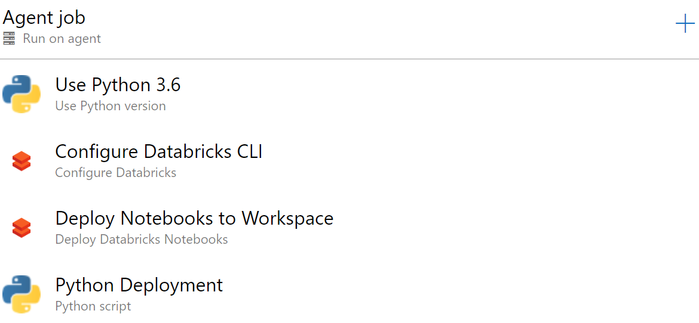

# DevOps for a Spark Jar, Egg Jobs

**Assumptions:**
1. You have created one or more (Dev/QA and Prod) Databricks Workspaces.
1. You have generated a [Personal Access Token (PAT)](https://docs.databricks.com/dev-tools/api/latest/authentication.html#generate-a-token).
1. You have created at least one mount point called `/mnt/jars` to house the jars or egg packages.
    * In this demo case, it's expecting two other mount points
    * `/mnt/input` with a file called `/mnt/input/bank/bank.csv` pulled from [UCI Machine Learning Repo](https://archive.ics.uci.edu/ml/datasets/Bank+Marketing)
    * `/mnt/output`
1. You are familiar with either Scala or Python.

## Table of Contents
* [Scala Jar App Build Pipeline](#scalaspark_app_build)
* [Python Egg App Build Pipeline](#pyspark_app_build)
* [Scala Jar App Release Pipeline](#release-scala-databricks)
* [Python Egg App Release Pipeline](#release-egg-databricks)
* [Python Notebook Release Pipeline](#release-python-notebook)

## Useful DevOps concepts
* [Release and Approval Gates](https://docs.microsoft.com/en-us/azure/devops/pipelines/release/approvals/?view=azure-devops) to control when a code release hits your environment and ask for approval from leadership before deployment.

## Build Pipeline

### ScalaSpark_App_Build
In the build pipeline, you are going to create the Jar as an artifact produced by the build.

1. Create a new Build Pipeline and name it ScalaSpark_App_Build
1. Choose "Use the classic editor" for a visual development experience.
1. Select a source
    * Azure Repos Git
    * Repository: D_AI_CE_DatabricksSparkDevOps
    * Default Branch: master
1. Search for a "Maven" template and apply.
1. In the Maven task, unlink the default Maven POM file and re-link it with `Scala/SparkSimpleApp/pom.xml`
1. All other default options are okay.
1. Save & queue.  You should now have a running pipeline.

### Pyspark_App_Build
1. Create a new Build Pipeline and name it Pyspark_App_Build
1. Choose "Use the classic editor" for a visual development experience.
1. Select a source
    * Azure Repos Git
    * Repository: D_AI_CE_DatabricksSparkDevOps
    * Default Branch: master
1. Search for a "Python" template and apply.
    * Delete the disabled Flake8 task.
    * For each task, if the "Advanced > Working Directory" option is present, set it as `Python/SparkSimpleApp`.
1. Select the versions of Python you will test against by changing the Variable `python.version` to `3.6, 3.7, 3.8`.
1. Change the `pytest command line` task to `pip install .\ && pip install pytest && pytest tests --doctest-modules --junitxml=junit/test-results.xml`
   * This will install the current working directory's package (`pip install .\` with the working directory set to `Python/SparkSimpleApp`).
1. Set the `Use Python` task under Publish to `3.7`.
1. Change `Build sdist`'s script to be `python setup.py bdist_egg` and change its Display name to `Build egg`
1. Change `Publish Artifact: dist` tasks' Path to Publish to `Python/SparkSimpleApp/dist`
1. All other default options are okay.
1. Save & queue.  You should now have a running pipeline.


## Release Pipelines

The release pipeline allows you to deploy your jar or egg job to your target compute: Databricks Spark.  Create your Release pipeline by going to Pipelines > Releases > + New Release Pipeline.  Start with an Empty Job.

<p align="center">
  
</p>

* Add two artifacts:
  * Build: Choose the source build pipeline, default verison of Latest and default Source Alias (`_ScalaSpark_App_Build` or `_Pypark_App_Build`).
  * Azure Repo Git: Choose the repository that your code exists in.  Name it **_code**.

* Add two stages:
  * QA
  * Prod

* Add two variable groups:
  * DevDatabricksVariables: Region and Token for Dev / QA environment
    * Add `DATABRICKS_REGION` (e.g. centralus or eastus2)
    * Add `DATABRICKS_TOKEN` and add your [Personal Access Token](https://docs.databricks.com/dev-tools/api/latest/authentication.html#generate-a-token).  Apply the Lock to make it a hidden variable.
    * Choose the Scope as Stage > QA
  * ProdDatabricksVariables: Region and Token for production environment
    * Add `DATABRICKS_REGION` (e.g. centralus or eastus2)
    * Add `DATABRICKS_TOKEN` and add your [Personal Access Token](https://docs.databricks.com/dev-tools/api/latest/authentication.html#generate-a-token).  Apply the Lock to make it a hidden variable.
    * Choose the Scope as Stage > Prod

* Add the Microsoft DevLabs' [DevOps for Azure Databricks](https://marketplace.visualstudio.com/items?itemName=riserrad.azdo-databricks) extension.  This will give us some handy tasks that sit on top of the Databricks CLI.  This will, however, force us to use a Windows Agent in the Release pipelines.
  * There's another extension by Data Thirst: [Databrick Script Deployment Task](https://marketplace.visualstudio.com/items?itemName=DataThirstLtd.databricksDeployScriptsTasks).  
  * Feel free to explore this extension as it has additional UI driven tasks for the Databricks CLI.

### Release Scala Databricks

<p align="center">
  
</p>

Add the following tasks to both the QA and Prod stages (Pro Tip: You can do this once in QA and then Clone the stage and rename).

1. Use Python Version 
    * Set Version Spec to 3.6
1. Configure Databricks (from Microsoft DevLabs)
   * Set Workspace URL to `https://$(DATABRICKS_REGION).azuredatabricks.net`
   * Set Access Token to `$(DATABRICKS_TOKEN)`
   * This creates a Databricks configuration profile of `AZDO`.  We pass this to the deployment.py file.
1. Databricks file to DBFS
   * Set Azure Region to `$(DATABRICKS_REGION)`
   * Set Local Root Folder to `$(System.DefaultWorkingDirectory)/_ScalaSpark_App_Build/drop/Scala/SparkSimpleApp/target`
   * Set File Pattern to `*.jar`
   * Set Target folder in DBFS to `/mnt/jars/`
   * Set Security 
     * Authentication Method: Bearer Token
     * Databricks Bearer token: `$(DATABRICKS_TOKEN)`
1. Python Script
   * Script Source: File Path
   * Script Path: `$(System.DefaultWorkingDirectory)/_code/deployment.py`
   * Arguments: 
  
  ```
  jar $(System.DefaultWorkingDirectory)/_ScalaSpark_App_Build/drop/Scala/SparkSimpleApp/target dbfs:/mnt/jars $(System.DefaultWorkingDirectory)/_code/Scala/SparkSimpleApp/job.json --main-class com.microsoft.spark.example.SparkSimpleApp --profile AZDO --parameters "/mnt/input/bank/bank.csv" "/mnt/output/SparkSimpleAppPY/test.csv"
  ```

You now have a working release pipeline!  Save and execute the Release!

### Release Egg Databricks

<p align="center">
  
</p>

Add the following tasks to both the QA and Prod stages (Pro Tip: You can do this once in QA and then Clone the stage and rename).

1. Use Python Version 
    * Set Version Spec to 3.6
1. Configure Databricks (from Microsoft DevLabs)
    * Set Workspace URL to `https://$(DATABRICKS_REGION).azuredatabricks.net`
    * Set Access Token to `$(DATABRICKS_TOKEN)`
    * This creates a Databricks configuration profile of `AZDO`.  We pass this to the deployment.py file.
1. Databricks file to DBFS
    * Set Azure Region to `$(DATABRICKS_REGION)`
    * Set Local Root Folder to `$(System.DefaultWorkingDirectory)/_Pyspark_App_Build/dist`
    * Set File Pattern to `*.jar`
    * Set Target folder in DBFS to `/mnt/jars/`
    * Set Security 
      * Authentication Method: Bearer Token
      * Databricks Bearer token: `$(DATABRICKS_TOKEN)`
1. Databricks file to DBFS
    * Set the settings the same as above with the following exceptions.
    * Set Local Root Folder to `$(System.DefaultWorkingDirectory)/_code/Python/SparkSimpleApp`
    * Set File Pattern to `main.py`
1. Python Script
    * Script Source: File Path
    * Script Path: `$(System.DefaultWorkingDirectory)/_code/deployment.py`
    * Arguments: 
  
  ```
  egg $(System.DefaultWorkingDirectory)/_Pyspark_App_Build/dist/ dbfs:/mnt/jars $(System.DefaultWorkingDirectory)/_code/Python/SparkSimpleApp/job.json --python-file "dbfs:/mnt/jars/main.py" --profile AZDO --parameters "/mnt/input/bank/bank.csv" "/mnt/output/SparkSimpleAppPY/test.csv" 
  ```

You now have a working release pipeline!  Save and execute the Release!

### Release Python Notebook

<p align="center">
  
</p>

For a Python notebook, we do not have a build process since no egg package is being created.  We can release the notebook immediately, however that leaves you open to logic errors.  Consider following the guidance from [Alexandre Gattiker](https://cloudarchitected.com/2019/11/unit-testing-databricks-notebooks/).  In this example, we assume the notebook is valid and can be pushed to QA and manually reviewed in that workspace.

Add the following tasks to both the QA and Prod stages (Pro Tip: You can do this once in QA and then Clone the stage and rename).

1. Use Python Version 
    * Set Version Spec to 3.6
1. Configure Databricks (from Microsoft DevLabs)
   * Set Workspace URL to `https://$(DATABRICKS_REGION).azuredatabricks.net`
   * Set Access Token to `$(DATABRICKS_TOKEN)`
   * This creates a Databricks configuration profile of `AZDO`.  We pass this to the deployment.py file.
1. Deploy Databricks Notebook
   * Set Notebooks Folder to `$(System.DefaultWorkingDirectory)/_code/Notebook`
   * Set Workspace Folder to `/Shared`
   * This will recreate the entire `_code/Notebook` structure (notebooks and folders) in the `/Shared/` folder in Databricks.
1. Python Script
    * Script Source: File Path
    * Script Path: `$(System.DefaultWorkingDirectory)/_code/deployment.py`
    * Arguments: 
  
  ```
  notebook na na $(System.DefaultWorkingDirectory)/_code/Notebook/job.json --notebook-path "/SparkSimpleNotebook" --profile AZDO --parameters "input" "/mnt/input/bank/bank.csv" "output" "/mnt/output/SparkSimpleAppNotebook/test" 
  ``` 

To add further to this example, you might:
* Deploy your notebook to a versioned folder number based on the [Pre-defined release variable](https://docs.microsoft.com/en-us/azure/devops/pipelines/release/variables?view=azure-devops&tabs=batch#default-variables) of `Release.DeploymentID`.
* Update an existing job and point to the new versioned folder.
* Execute the notebook with the Microsoft DevLabs extension task.

You now have a working pipeline to deploy Azure Databricks Notebooks!  Save and execute the Release!

## Additional Functionality

### Update an Existing Job by Name or Job_ID

This deployment script does NOT help with identifying existing jobs and shutting them down.

Instead, you can specify the `--update-if-exists` flag to change an existing job if it is found.

You can either pass `--update-if-exists job_id XXX` with XXX being a known job-id and it will update the job found when looking up job-id XXX.

Alternatively, you can pass in the name of the job like `--update-if-exists name my_job_name`.  This will look up the job-id for the first match it finds (ordering not guaranteed) based on the name of the job.  The downsides are:
* Databricks allows for multiple jobs to share the same name (why?!?)
* The output of `databricks jobs list` seems to be smaller job-id first.
* You could miss existing active jobs with schedules if they have later job-id's and the same name.


# deployment.py

The deployment.py file helps abstract the calls to the Databricks CLI and enables you to replace text in the job's json definition.

The help file below describes the usage.

```
usage: deployment.py [-h] [--python-file PYTHON_FILE]
                     [--main-class MAIN_CLASS] [--notebook-path NOTEBOOK_PATH]
                     [--profile PROFILE]
                     [--update-if-exists UPDATE_IF_EXISTS UPDATE_IF_EXISTS]
                     [--parameters ...]
                     {jar,egg,notebook} library_path cloud_path job_json

Deploy a set of jar or egg files as a Spark application

positional arguments:
  {jar,egg,notebook}    Valid options are jar, egg, or notebook
  library_path          The library or folder containing libraries to include.
                        Use na for no libraries.
  cloud_path            The path in the cloud (e.g. DBFS, WASB) that the
                        library is located. Use na for no libraries.
  job_json              The path to the job definition (only applicable to
                        Databricks)

optional arguments:
  -h, --help            show this help message and exit
  --python-file PYTHON_FILE
                        (egg option) The python file that runs the python
                        application
  --main-class MAIN_CLASS
                        (jar option) The main class of your scala jar
                        application
  --notebook-path NOTEBOOK_PATH
                        (notebook option)The path to your notebook in your
                        databricks workspace
  --profile PROFILE     Profile name to be passed to the databricks CLI
  --update-if-exists UPDATE_IF_EXISTS UPDATE_IF_EXISTS
                        Looks for a job_id or name (useful only for Databricks
                        deployments)
  --parameters ...      List of parameters that get passed directly to the
                        spark jar / python task. This must be the last
                        parameter.
```
